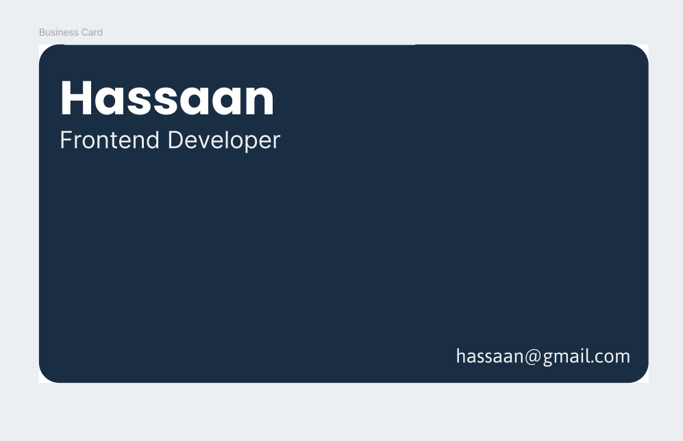
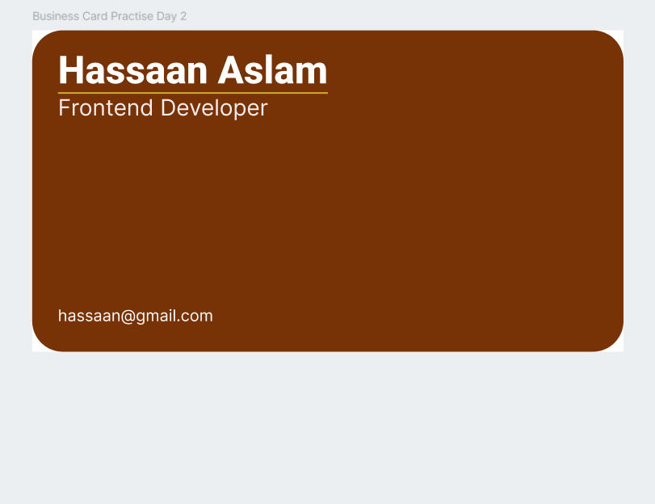

# Daily Progress

## Day 1 of Figma 🎨

Built a business card from zero in 60 minutes. As a frontend dev, I realized design isn't that scary — it's just another skill.

## Day 2 

- Revised and create a practise card component as practise of Day 1.

- Now i am creating a button component three type of buttons primary secondary and danger.